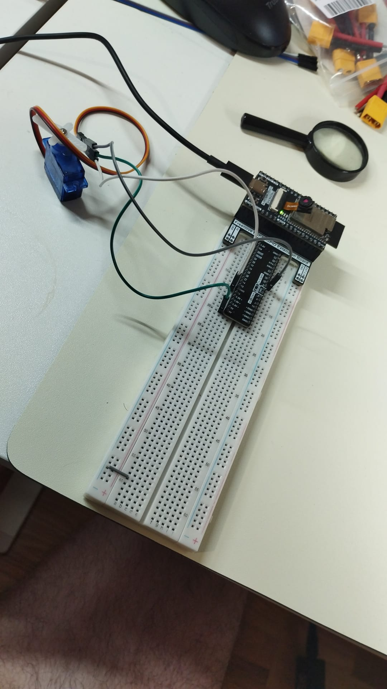
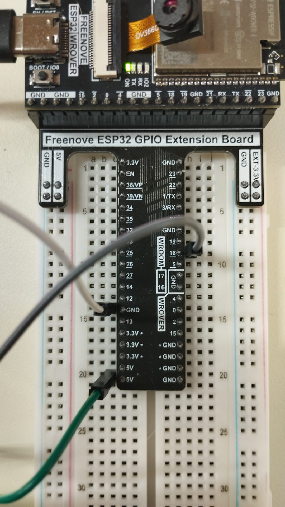
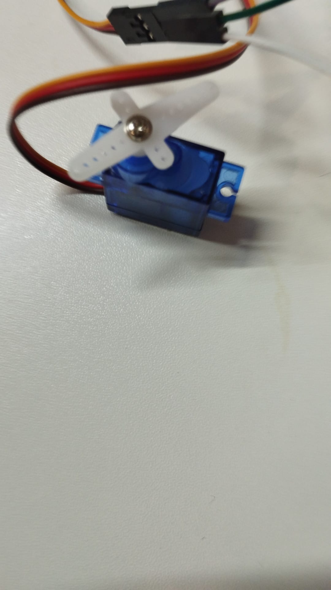

# Servo Basic – ESP32 (PlatformIO)

📘 **Languages**
- [English](#english)
- [Eesti](#eesti)
- [Italiano](#italiano)

---

## English

This project demonstrates how to control a hobby servo motor using an ESP32
and a PWM signal generated via the `ESP32Servo` library.

The servo is moved to three positions (0°, 90°, 180°) in a repeating loop.
Serial prints are used to confirm the commanded positions.

### Key concepts
- A hobby servo expects a PWM signal around **50 Hz** (period ~20 ms).
- The servo position is mainly encoded by **pulse width** (microseconds).
- On ESP32 it is recommended to use **ESP32Servo** instead of the classic Arduino `Servo.h`.

### Hardware
- ESP32 development board (ESP-WROVER-KIT environment used in PlatformIO)
- Hobby servo (e.g. SG90 / MG90S)
- Breadboard / jumper wires
- (Recommended) External 5V supply for the servo

### Wiring (typical 3-wire servo)
| Servo wire | Connect to | Notes |
|---|---|---|
| Red | +5V | Prefer external 5V for stable current |
| Brown / Black | GND | Must be common with ESP32 GND |
| Orange / Yellow (signal) | GPIO18 | PWM control signal |

**Important:** Always connect **servo GND** and **ESP32 GND** together (common ground).

### Photos
  
  

### Software
- IDE: Visual Studio Code
- Build system: PlatformIO
- Framework: Arduino (ESP32)
- Library: `madhephaestus/ESP32Servo`

In `platformio.ini`:
- `monitor_speed = 115200` is used to match `Serial.begin(115200)`.

### How it works
1. Initialize Serial output at 115200 baud
2. Attach the servo to a GPIO pin with a defined pulse width range
3. Command positions using `servo.write(angle)`
4. Print debug messages on the Serial Monitor

---

## Eesti

See projekt näitab, kuidas juhtida hobi-servomootorit ESP32 abil.
PWM-signaal tekitatakse `ESP32Servo` teegi abil.

Servo liigub korduvtsüklis kolme asendisse (0°, 90°, 180°).
Seriali väljund aitab kinnitada käsitud asendeid.

### Põhimõtted
- Hobi-servo kasutab tavaliselt PWM-signaali umbes **50 Hz** (periood ~20 ms).
- Asend sõltub peamiselt **impulsi laiusest** (mikrosekundites).
- ESP32 puhul on soovitatav kasutada **ESP32Servo** teeki.

### Ühendused (3-juhtmeline servo)
| Servo juhe | Ühenda | Märkus |
|---|---|---|
| Punane | +5V | Soovitatav väline 5V toide |
| Pruun / Must | GND | Peab olema ühine ESP32 GND-ga |
| Oranž / Kollane (signaal) | GPIO18 | PWM juhtsignaal |

**Tähtis:** Servo GND ja ESP32 GND peavad olema ühendatud (ühine maa).

### Tarkvara
- IDE: Visual Studio Code
- Ehitussüsteem: PlatformIO
- Raamistik: Arduino (ESP32)
- Teek: `madhephaestus/ESP32Servo`

---

## Italiano

Questo progetto mostra come controllare un servomotore hobby tramite ESP32,
generando il segnale PWM con la libreria `ESP32Servo`.

Il servo viene posizionato ciclicamente su tre angoli (0°, 90°, 180°).
Le stampe su Serial Monitor confermano gli angoli comandati.

### Concetti chiave
- Un servo hobby richiede un PWM intorno a **50 Hz** (periodo ~20 ms).
- La posizione è principalmente determinata dalla **larghezza dell’impulso** (in microsecondi).
- Su ESP32 è consigliato usare **ESP32Servo** invece della classica `Servo.h`.

### Collegamenti (servo a 3 fili)
| Filo servo | Collegamento | Note |
|---|---|---|
| Rosso | +5V | Consigliata alimentazione esterna 5V |
| Marrone / Nero | GND | Deve essere in comune con GND ESP32 |
| Arancione / Giallo (segnale) | GPIO18 | Segnale PWM di controllo |

**Importante:** collegare sempre il **GND del servo** con il **GND dell’ESP32** (massa comune).

### Software
- IDE: Visual Studio Code
- Sistema di build: PlatformIO
- Framework: Arduino (ESP32)
- Libreria: `madhephaestus/ESP32Servo`

Nel `platformio.ini`:
- `monitor_speed = 115200` deve combaciare con `Serial.begin(115200)`.
